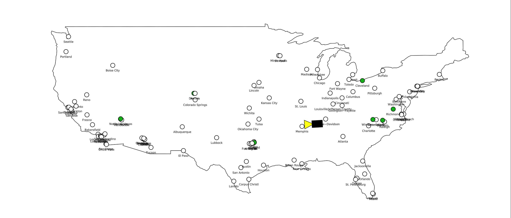

# About

A zero-player idle game for [Cuis Smalltalk](https://cuis.st/).

# Code

Includes `ZoomPanMorph` which might be useful to other projects as well.

# Requirements

A Cuis system later than 6.2 for with [this commit](https://github.com/Cuis-Smalltalk/Cuis-Smalltalk-Dev/commit/ad2fda03f9b237026df0ae8c6ec2517a0ff5a4b1), which currently means using [the dev branch](https://github.com/Cuis-Smalltalk/Cuis-Smalltalk-Dev) of Cuis.

# Contributors

- [Ian Jeffries](https://github.com/seagreen)
- [Juan Vuletich](https://github.com/jvuletich)
